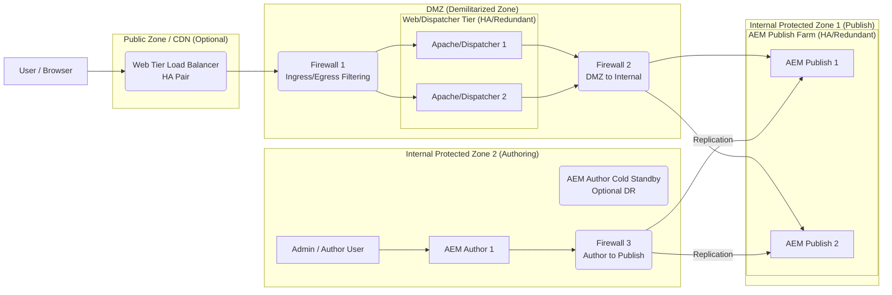

# AEM Infrastructure POC Diagram and Explanation

## Introduction

This document outlines a Proof-of-Concept (POC) infrastructure design for Adobe Experience Manager (AEM) focusing on three core principles: **Security**, **High Availability (HA)**, and **Redundancy**. The diagram below illustrates a standard, robust setup suitable for production environments.

## Architecture Diagram (Mermaid)

## Diagram Explanation

Here's a breakdown of each component and how it contributes to the core requirements:

1. **User / Browser:** The end-user accessing the website. Their requests initiate the flow.

2. **Web Tier Load Balancer (HA Pair):**

    * **Function:** Distributes incoming user traffic across the available Dispatcher instances.

    * **High Availability:** Ensures that if one Dispatcher instance fails, traffic is automatically routed to the healthy ones, preventing downtime for the web tier. Often deployed as an HA pair itself for **Redundancy** at the load balancer level.

    * **Security:** Acts as the primary public entry point, shielding the internal infrastructure.

3. **Firewall 1 (Ingress/Egress Filtering):**

    * **Function:** Controls network traffic entering and leaving the Demilitarized Zone (DMZ).

    * **Security:** Enforces strict rules, allowing only necessary ports (e.g., HTTP/80, HTTPS/443) and protocols, protecting the DMZ from unauthorized external access.

4. **Web/Dispatcher Tier (HA/Redundant):**

    * **Function:** Consists of multiple Apache HTTP Server instances with the AEM Dispatcher module. They serve cached content, filter incoming requests, perform URL rewriting, and balance load across the AEM Publish instances.

    * **High Availability:** Provided by having multiple instances managed by the Load Balancer.

    * **Redundancy:** Multiple identical instances ensure service continuity if one fails.

    * **Security:** The Dispatcher module filters malicious requests, prevents direct access to sensitive AEM paths, and protects the AEM Publish instances. Locating this tier in a DMZ adds another layer of **Security**.

5. **Firewall 2 (DMZ to Internal):**

    * **Function:** Controls network traffic between the DMZ (Dispatcher Tier) and the internal network zone housing the AEM Publish instances.

    * **Security:** Provides a critical security boundary, ensuring only the Dispatchers can communicate with the Publish instances on specific ports (e.g., 4503), preventing direct external access to the Publish tier.

6. **AEM Publish Farm (HA/Redundant):**

    * **Function:** Consists of multiple AEM instances running in Publish mode, serving the live website content to the Dispatchers.

    * **High Availability:** If one Publish instance fails, the Dispatchers can route requests to the remaining healthy instances.

    * **Redundancy:** Having multiple instances ensures content serving capacity and resilience against single-instance failure.

    * **Security:** Isolated from direct user access by Firewalls and the Dispatcher tier.

7. **Firewall 3 (Author to Publish):**

    * **Function:** Controls network traffic specifically between the AEM Author instance(s) and the AEM Publish instances.

    * **Security:** Strictly limits communication, typically allowing only the ports required for content replication, preventing unwanted access from the Authoring environment to the Publish environment.

8. **AEM Author 1:**

    * **Function:** The AEM instance used by content authors and administrators to create, manage, and prepare content for publication.

    * **Security:** Located in a highly secured internal network zone, often accessible only via VPN or internal corporate network, minimizing its exposure.

9. **AEM Author Cold Standby (Optional DR):**

    * **Function:** An identical copy of the primary AEM Author instance, kept offline (cold). It can be started manually or semi-automatically if the primary Author fails catastrophically.

    * **Redundancy:** Provides Disaster Recovery capability for the authoring environment, ensuring content creation can resume after a major failure, although with some recovery time (RTO).

10. **Admin / Author User:** Internal users (content creators, administrators) who access the AEM Author instance. Access is typically secured via internal network policies or VPN.

11. **Replication:** The process where content approved on the Author instance is securely pushed (activated) to all Publish instances in the farm, making it live on the website. Replication agents manage this secure transfer.

## Key Principles Summary

* **Security:** Achieved through multiple layers of firewalls, network segmentation (DMZ, Internal Zones), Dispatcher filtering, controlled replication paths, and restricted access to the Author instance.

* **High Availability:** Ensured by eliminating single points of failure through multiple instances at the Load Balancer, Dispatcher, and Publish tiers, allowing the system to continue operating even if individual components fail.

* **Redundancy:** Provided by having duplicate components (Load Balancers, Dispatchers, Publish instances, optional Author Standby) ready to take over workload or provide backup capability.

## Conclusion

This infrastructure design provides a robust foundation for hosting AEM applications. By incorporating multiple instances, load balancing, firewalls, and network segmentation, it effectively addresses the critical requirements for a secure, highly available, and redundant AEM deployment.

